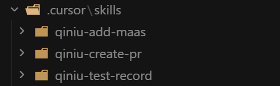
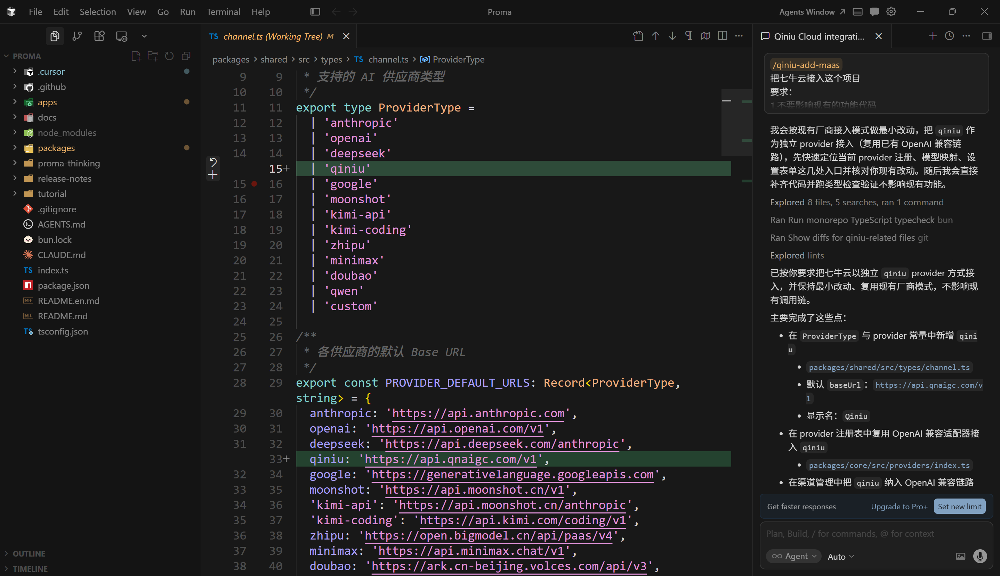
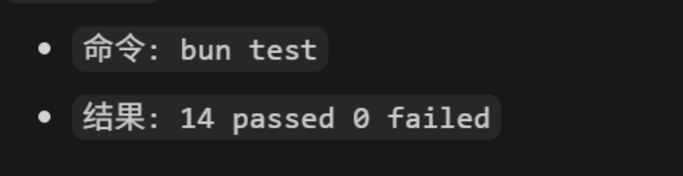
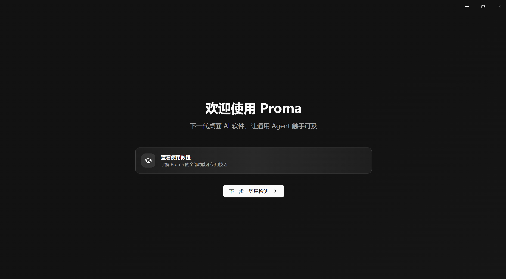
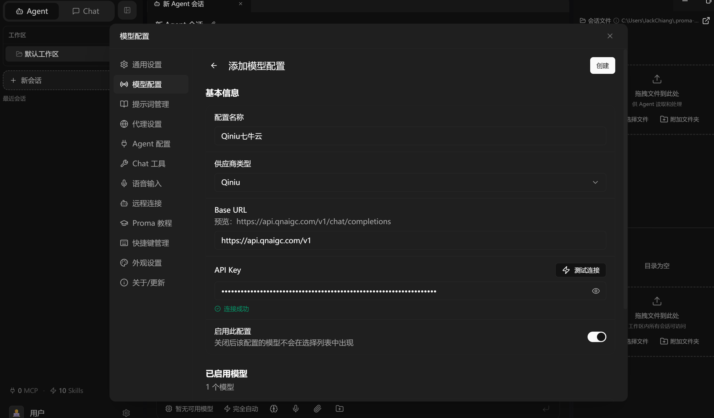
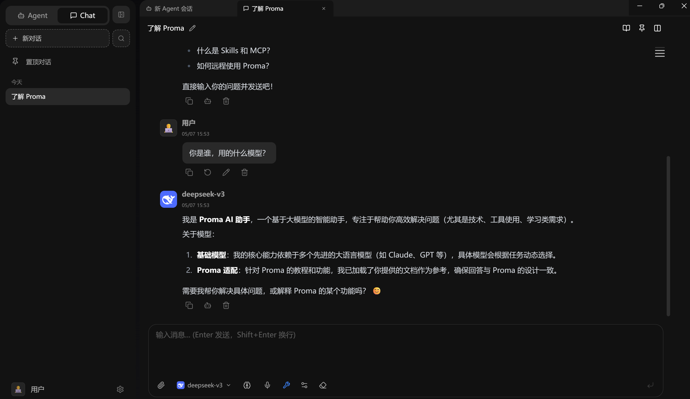

# 七牛云 MaaS 集成指导文档
用于快速完成七牛云 MaaS 厂商接入、测试记录生成以及 PR 自动生成。

需要用到的 skills 包含:
- [`qiniu-add-maas`](https://github.com/AI-Hub-Growth/skillhub/tree/main/qiniu-maas/qiniu-add-maas) - 用于生成厂商接入的代码
- [`qiniu-test-record`](https://github.com/AI-Hub-Growth/skillhub/tree/main/qiniu-maas/qiniu-test-record) - 用于自动运行并生成测试的结果
- [`qiniu-create-pr`](https://github.com/AI-Hub-Growth/skillhub/tree/main/qiniu-maas/qiniu-create-pr) - 用于自动生成PR


相关操作的示例：
- 以接入 Proma 这个开源项目作为示例

## 使用说明


### 1. 进入要接入的项目目录

### 2. 下载 skills 到项目目录中

选择一个 AI 工具，如 cursor / claude code 等。

在 AI 工具命令行中，运行以下指令:
```
https://github.com/AI-Hub-Growth/skillhub/tree/main/qiniu-maas
把这个地址的3个 skills 下载到项目目录
```

- 以 cursor 为例 skills 会存放到以下目录中



### 3. 生成厂商接入的代码
在 AI 工具命令行中，执行下面的指令:
```
/qiniu-add-maas 把七牛云接入这个项目
要求：
1.不要影响现有的功能代码
2.可以参照其他的厂商的写法
3.代码风格和其他厂商保持一致
```
这个过程会生成厂商接入相关的代码。


- 操作完成后，可以看到厂商接入的代码已完成生成



### 4. 自动检测并运行相关测试
在 AI 工具命令行中，执行下面的指令:
```
/qiniu-test-record  把这个项目扫一遍
```
这个过程会先检测项目相关的测试，并自动安装测试所需的依赖，最后自动运行测试，生成结果。

- 正常情况下，0 failed，没有失败用例代，可以进行下一步:



- 如果出现有失败的案例，则需要返回第1步，review 代码的改动，找到问题，重新测试，直到测试通过才能进行下一步。


### 5. 人工验证接入的厂商

#### 5.1 在本地项目安装全量所需的依赖，并在本地dev环境中运行这个项目

在 AI 工具命令行中，执行下面的指令:
```
把这个项目在本地跑起来
```

- 如图，我们可以看到界面了:



#### 5.2 找到 qiniu 对应的入口，配置 API Key (例如: sk-xxxx)，选择模型。

- 如图所示，我们找到相关的配置界面，进行配置:



- 若出现问题，则需要返回第1步，review代码的问题。

#### 5.3 在相关的对话窗口设置模型并测试，若得到正确反馈，即为验证成功。

- 如图所示，我们找到相应的对话界面，设置好模型并进行测试:



- 若出现问题，则需要返回第1步，review代码的问题。


### 6. 自动生成PR
在 AI 工具命令行中，执行下面的指令:
```
/qiniu-create-pr 帮我生成这个项目的PR
```
这个过程会根据文件的改动，和测试的结果，生成PR。


- 执行完毕后，我们能得到 md 版本的PR，如下所示:

```
## Summary
Added support for Qiniu AI (七牛云) as a new model provider.

## What changed

- `apps/electron/src/main/lib/channel-manager.ts` - Adds main-process channel handling to support the new provider flow.
- `apps/electron/src/renderer/components/settings/ChannelForm.tsx` - Updates the settings form UI to configure Qiniu provider options.
- `apps/electron/src/renderer/lib/model-logo.ts` - Registers logo mapping for Qiniu-related models in the renderer.
- `packages/core/src/providers/index.ts` - Exposes the Qiniu provider in the core provider registry.
- `packages/shared/src/types/channel.ts` - Extends shared channel type definitions for Qiniu provider fields.

## Testing
  bun test
  # 14 passed 0 failed

```

- 这是一个通用的模板，若官方有其他的要求，如提供成功截图等，以官方为准。

- 之后提交PR即可。
